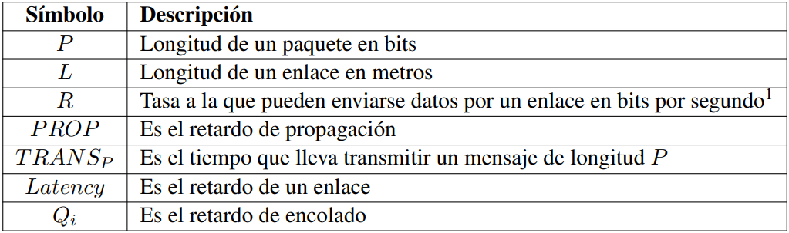

[🏡 Inicio](../../index.html)

# Tema 1: Introducción a la Arquitectura y Organización de las Redes de Ordenadores

## Índice

- [Conceptos iniciales](#Punto1)
  
  - Elementos básicos de una red de comunicaciones
  
  - Clasificación de las redes de comunicaciones

- [Estrategias de Conmutación](#Punto2)
  
  - Conmutación de circuitos
  
  - Conmutación de mensajes
  
  - Conmutación de paquetes
  
  - Conmutación de circuitos virtuales
  
  - Ganancia por multiplexación estadística
  
  - Discusión y comparativa de esquemas

- [Arquitectura por niveles: OSI vs. TCP/IP](#Punto3)

- [Aspectos de diseño de Internet](#Punto4)

- [Organización y estructura de Internet](#Punto5)

## 

## Conceptos iniciales <a name="Punto1"><a>

> Una red es una colección *interconectada* de dispositivos *autónomos*. 

Es interconectada porque existen enlaces de comunicaciones y caminos entre los diferentes dispositivos, de tal forma que es posible el intercambio de mensajes entre ellos. Los dispositivos son autónomos porque cada dispositivo ejecuta su propio software y la única forma de coordinarse con otros nodos es mediante el intercambio de mensajes.

### Elementos básicos de una red de comunicaciones

Una red de comunicaciones consta de diferentes elementos que se diferencian fundamentalmente por las funciones que realizan, pueden ser tanto hardware como software.

- **Sistemas finales**: También conocidos como *hosts*, los sistemas finales son los dispositivos que ejecutan aplicaciones de usuario y se conectan a la red para poder acceder a servicios o datos disponibles en cualquier dispositivo conectado a la red.

- **Enlaces de comunicación**: Son los medios físicos que conectan uno o varios dispositivos que pueden ser tanto sistemas finales como dispositivos internos de la red.
  Algunas características distintivas de un enlace de comunicaciones son la velocidad de transmisión (bits por segundo) y el retardo (segundos). El retardo se define como el tiempo que tarda un bit en atravesar el enlace de comunicación.

Hay dos tipos de medios de transmisión:

- **Cableados**: También conocidos como medios guiados, son aquellos en los que el flujo de bits se transmite a través de un cable, bien sea en forma de señal eléctrica o en forma de impulsos luminosos.

- **Inalámbricos**: Son aquellos en los que el flujo de bits se transmite en forma de onda electromagnética que se propaga a través del espacio libre (p.ej: IEEE 802.11a/b/g).

En general, los medios cableados son más fiables y tolerantes a interferencias, por lo que suelen conseguir mejores tasas de transferencia, y menores tasas de error. Sin embargo, los enlaces inlámbricos pueden ser muy útiles en determinadas situaciones.

- Los **dispositivos de conmutación** son aquellos elementos de la red que se encargan de interconectar enlaces de comunicaciones para facilitar el intercambio de datos entre dispositivos de la red.

Los dispositivos de conmutación suelen disponer de mútliples interfaces o puertos, de tal forma que cuando llegan datos por uno de esos puertos, lo retransmiten por la interfaz o puerto que corresponda para que esos datos sean dirigidos al destino. Los dispositivos de conmutación son la respuesta natural a la necesidad de interconectar segmentos de red para conseguir expandir el alcance de una red.

- Los **protocolos** son las reglas y convenciones que se siguen en la conversación entre el software que se ejecuta en dos dispositivos que intercambian información.

Cuando dos dispositivos, que pueden ser equipos finales o de conmutación, intercambian datos, se implementa una comunicación entre un programa software que se ejecuta en un dispositivo y otro programa software que se ejecuta en el otro dispositivo. Para que este intercambio sea eficaz, es necesario seguir ciertas actuaciones, la definición de cómo se hace ese intercambio es lo que se conoce como <u>protocolo</u>. Los protocolos se diseñan de tal forma que, si ambos programas implementan correctamente el protocolo, la transferencia de información es posible.

### Clasificación de las redes de comunicaciones

Existen múltiples clasificaciones de las redes de comunicaciones atendiendo a una gran variedad de criterios. Centraremos nuestra clasificación atendiendo a la localidad espacial de la red:

- **Redes de área local**: Generalmente llamadas **LAN** (*Local Area Network*), son redes de propiedad privada (una sala, un hogar, etc). 
  Las LAN tradicionales, como Ethernet, se basaban en la idea de utilizar un cable de cobre compartido por todos los ordenadores a través del cual podían comunicarse a velocidades de 10 Mbps.
  En la actualidad se emplean entornos conmutados en los que los hosts se conectan a uno o varios switches Ethernet, que solo envían tráfico por aquellos puertos necesarios para llegar al destino. Tecnologías cableadas como FastEthernet y GigabitEthernet pueden llegar a velocidades de transmisión de 100 y 1000 Mbps respectivamente. Hoy en día también hay tecnologías inalámbricas bien conocidas, como IEEE 802.11a/b/c.

- **Redes de área metropolitana**: Generalmente llamadas **MAN** (*Metropolitan Area Network*), son una versión más grande de una LAN (un grupo de oficinas, dependencias en edificios cercanos, etc). Pueden ser públicas o privadas.
  La interconexión se realiza a nivel físico con enlaces punto a punto entre ellas mediante cables o inalámbricamente. En su momento, el estandar IEEE 802.6 definía la versión cableada de estas redes, no obstante ya no está a la altura de las tecnologías actuales, por lo que suele ser más efectivo interconectar estas dependencias a través de las WAN.

- **Redes de área extensa**: Generalmente llamadas **WAN** (*Wide Area Network*), se extienden sobre un área geográfica grande, como puede ser un país o un continente. Se diseñan de tal forma que la subred cuente con un núcleo de enlaces de alta capacidad llamados *troncales*, ya que las demandas de capacidad suelen ser mayores en estos enlaces que en las redes de los equipos finales.
  Hoy en día existen multitud de tecnologías para redes de área extensa como: FrameRelay, ATM (*Asyncronous Transfer Mode*) o SONET (*Synchronous Optical Network*). Una red WAN suele emplear diferentes tecnologías para diferentes parted de la red en función de las demandas de tráfico.

## Estrategias de Conmutación 

> Llamamos **estrategias de conmutación** a las diferentes alternativas que existen para hacer llegar la información de unos elementos de la red a otros a través de los enlaces y los dispositivos intermedios.

Generalmente, cualquiera de las tecnologías de red existentes se basan en alguna de las siguientes estrategias:

- Conmutación de circuitos.

- Conmutación de mensajes.

- <mark>Conmutación de paquetes.</mark>

- <mark>Conmutación de circuitos virtuales.</mark>

Las más utilizadas hoy en día son la conmutación de circuitos virtuales y la conmutación de paquetes.

Para poder comparar las distintas estrategias usaremos la siguiente notación:

Donde el *retardo de propagación* se corresponde al tiempo que tarda un bit en recorrer la longitud de un enlace. Se puede calcular de la siguiente forma:

Siendo *c* la velocidad de la luz. Puesto que no en todos los medios físicos los bits viajan a la velocidad de la luz, el tiempo que lleva transmitir un mensaje de una determinada longitud P se puede calcular como:

Otro parámetro interesante es el *retardo* o *Latency*, que consiste en el tiempo transcurrido desde que se envió el primer bit hasta que se recibe el último en el otro extremo del enlace. Puede calcularse como:

En algunos casos es necesario tener en cuenta el *retardo de encolado*, que es el tiempo que ha de estar un mensaje almacenado en un dispositivo de conmutación hasta que el enlace está libre y puede comenzar su transmisión. En estos casos, el retardo total se calcula como:

### Conmutación de circuitos
